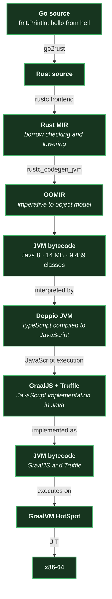
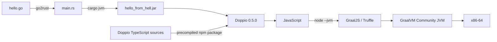

# The pipeline

One hello world, two JVMs, and JavaScript in the middle. Status as of
2026-09-20: **verified end to end**.

## The tower



## Why this is genuinely nested

```text
hello_from_hell.jar
  └─ JVM bytecode produced from Rust
      └─ Doppio's JVM interpreter
          └─ JavaScript compiled from TypeScript
              └─ GraalJS language implementation
                  └─ Truffle AST execution and specialization
                      └─ Java classes / JVM bytecode
                          └─ GraalVM HotSpot
                              └─ x86-64
```

The proof is not merely that a GraalVM image contains Java. Stage 1 starts Node
with `--jvm --polyglot`, then accesses `java.lang.System` from JavaScript and
prints:

```text
java.vm.name   = OpenJDK 64-Bit Server VM
java.vm.vendor = GraalVM Community
os.arch        = amd64
```

Only after that check does the same image invoke Doppio and print
`hello from hell` from the Go-derived jar.

## Assembly



The container pins Doppio 0.5.0 and GraalVM Node.js Community 23.0.2. Doppio's
installer supplies its Java 8 class library. The generated payload is also Java
8 bytecode (class-file major version 52), which is the compatibility hinge that
makes this old research JVM usable.

## Reproduce

```bash
./scripts/stage0.sh
./scripts/stage1-doppio.sh
```

Stage 1 builds `stage1-jvm/Dockerfile`, proves JVM mode through Java interop,
and runs the payload. The expected final line is:

```text
hello from hell
```

Doppio uses BrowserFS's deprecated-but-supported legacy ZipFS API. The stage-1
wrapper suppresses only those known compatibility notices while preserving all
other warnings and errors.
